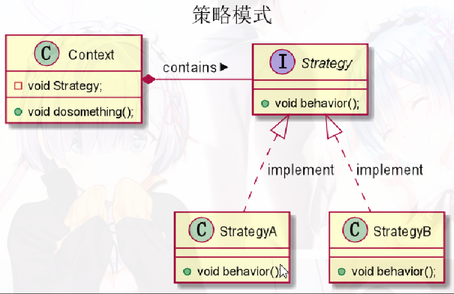

# 设计模式学习

## 单例模式

确保一个类只有一个实例，并提供该实例的全局访问

- 私有静态变量，私有构造函数，共有的静态方法

```java
//懒汉式
private static Singleton singleton;
//饿汉式
private static Singleton singleton = new Singleton();
//双重校验锁
if(singleton == null){
    synchronized(Singletong.class){
        if(singleton == null)
            singleton = new Singleton();
    }
}
//静态内部类实现，在获取实例的时候才加载内部类
private static class SingletonHolder{
    private static final Singleton singleton = new Singleton();
}
```

## 策略模式

- Strategy 定义了一个算法族类, 每一个族类都有一个behavior方法.
- Context类拥有Strategy族类, 动态调用behavior方法,也就是说动态该表context的的算法.



```java
public interface Strategy {
    public void behavior();
}
```

```java
public class StrategyA implements Strategy{
    @Override
    public void behavior() {
        print("A");
    }
}
```

```java
public class StrategyB implements Strategy{
    @Override
    public void behavior() {
        print("B");
    }
}
```

```java
public class Context {
    private Strategy strategy;
    public void dosomething(){
        strategy.behavior;
    }
    public void setStrategy(Strategy strategy) {
        this.strategy = strategy;
    }
}
```

## 适配器模式

有一个Source类，带适配，目标接口Targetable，通过Adapter类将Source的功能扩展到Tagetable里

类适配器模式，对象适配器模式，接口适配器模式

 

```java
public class Source{
    public void method1(){
        sout("this is original method!");
    }
}
```

```java
public interface Targetable{
    public void method1();
    public void method2();
}
```

```java
//Tagetable实现类具有了Source的功能
public class Adapter extends Source implements Targetable{
    public void method2(){
        sout("this is Targetable method!");
    }
}
public class Wrapper implements Targetable{
    private Source source;
    public Wrapper(Source source){
        super;
        this.source = source;
    }
    public void method1(){}
    public void method2(){}
}
```

## 装饰模式

Source是被装饰类，Decorator是装饰类，可以为Source动态添加功能

 

```java
public interface Sourceable{
    public void method();
}
```

```java
public class Source implements Sourceable{
    public void method(){
        sout("this is original method!");
    }
}
```

```java
public class Decorator implements Sourceable{
    private Source source;
    public Decorator(Source source){
        super;
        this.source = source;
    }
    public void method(){
        sout("before decorator method!");
        source.method();
        sout("after decorator method!");
    }
}
```

## 代理模式

 

```java
public interface Sourceable{
    public void method();
}
```

```java
public class Source implements Sourceable{
    public void method(){
        sout("this is original method!");
    }
}
```

```java
public class Proxy implements Sourceable{
    private Source source;
    public Proxy(){
        super;
        this.source = new Source();
    }
    public void method(){
        sout("before decorator method!");
        source.method();
        sout("after decorator method!");
    }
}
```
